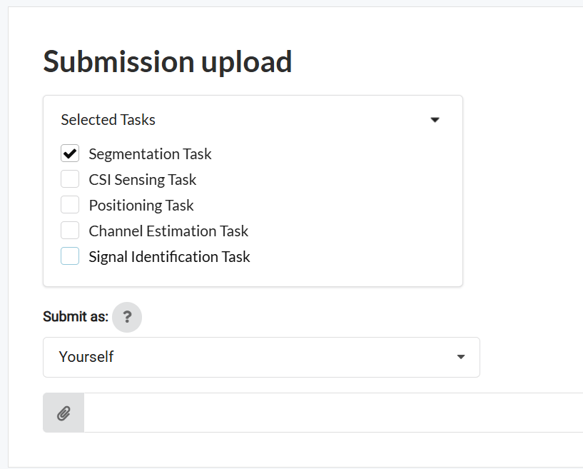

# Instructions

In this challenge, you are tasked with developing your own model that utilizes the pre-trained encoder as its foundation. The encoder embeds input spectrogram information, while the remaining parts of your model will be tailored to complete the specific task at hand.

A detailed implementation example of the encoder, various models, and dataset processing steps can be found in our [GitHub repository](https://github.com/AhmedTarek62/mae/tree/challenge1). **We strongly encourage you to review the repository before starting your development.**

Within the `tasks` folder of the repository, you will find the following files for each task:

In that repository, you can find in `tasks` folder, the following files for each task:

 * `model.py`:
 This file builds the model architecture layers and must include a function that loads the pre-trained model checkpoint prior to fine-tuning. **This step will be verified for each participant!** [Example of the required file for submission.]

 * `finetuning_engine.py`: 
 A file that implements the pipeline for fine-tuning and validation during the fine-tuning process.

 * `dataset.py`: A file detailing the necessary processing steps to load the content of each dataset.

* `config.yaml`: This file specifies configurations such as dataset paths, model parameters, and hyperparameters. [Different from the required submission file.]

# At Submission 

**⚠️At submission, please ensure you uncheck the boxes for any tasks you are not submitting to. Your `Submission upload` box must look similar to the example shown below if you are submitting for the Segmentation Task for instance:**

<!--  -->

By adhering to these guidelines, we can ensure consistency and fairness in evaluating all submissions. Best of luck!