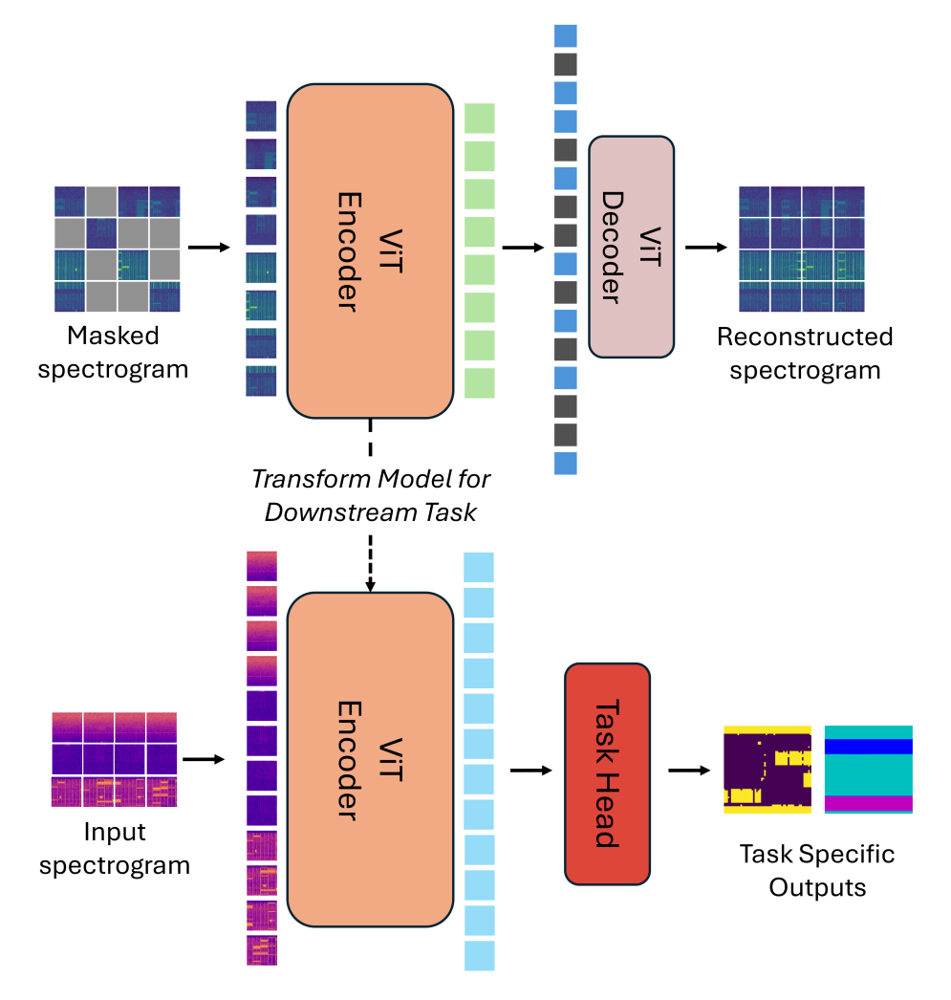

# Overview
The **Specialized Radio Foundation Model (SRFM) Fine-tuning** Challenge invites participants to explore and innovate using the SRFM, a cutting-edge foundation model for radio tasks, as detailed in [this paper](https://arxiv.org/pdf/2411.09996).

The goal of this challenge is to fine-tune the SRFM for various radio applications, pushing the boundaries of machine learning in the wireless communication domain. Participants will tackle diverse tasks such as *signal classification*, *channel estimation*, or *channel state information sensing*, demonstrating the model's adaptability and performance improvements in specialized scenarios.

This challenge not only provides an opportunity to engage with a state-of-the-art model but also contributes to advancing wireless communication technologies, paving the way for robust and efficient AI-driven radio systems.

<!--  -->


# WAVES Lab
The challenge is brought to you by [**WAVES Lab**](https://www.hatem-abouzeid.com/waves-lab), a research lab at the University of Calgary, Canada, directed by Dr. Hatem Abou-Zeid


### **Join us in this exciting challenge to drive innovation at the intersection of wireless communication and machine learning!**

**Citation**:
```
@article{aboulfotouh,
  title={Building 6G Radio Foundation Models with Transformer Architectures},
  author={Aboulfotouh, Ahmed and Eshaghbeigi, Ashkan and Abou-Zeid, Hatem},
  journal={arXiv preprint arXiv:2411.09996},
  year={2024}
}
```